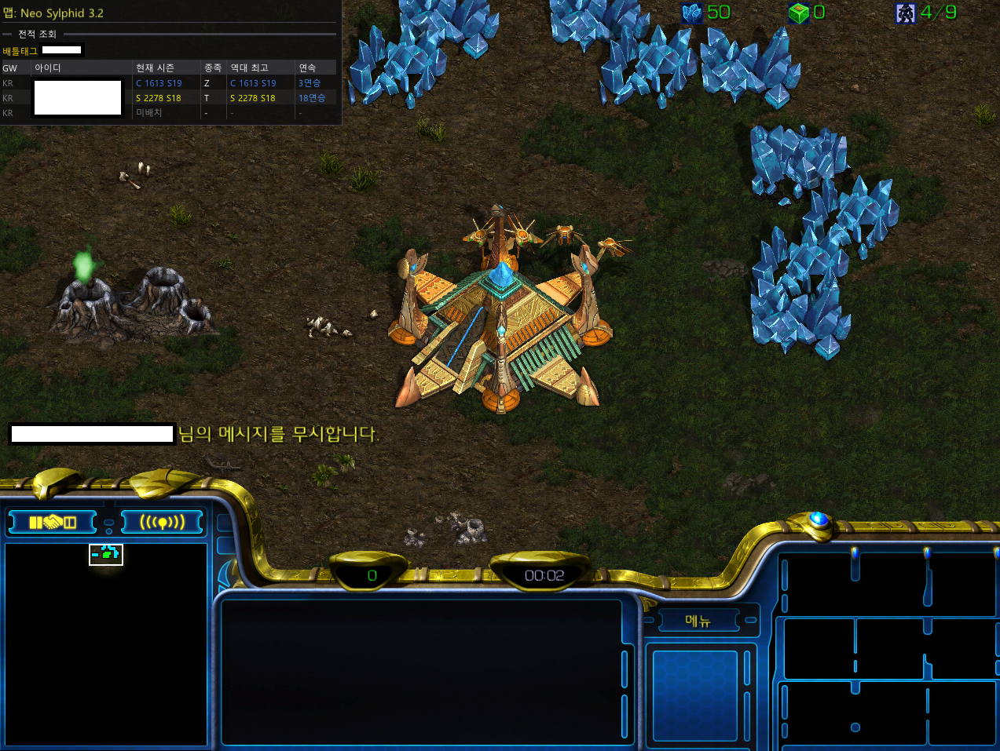

# bw_auto_ignore

[English](README.en.md) | [한국어](README.md)

> StarCraft: Remastered in-game overlay — auto-lookup opponent stats, block chat, and stay focused on the game.

[Download (.exe)](https://github.com/ikbeomjeon/bw_auto_ignore/raw/main/dist/bw_auto_ignore.exe) | Or build directly with Visual Studio 2022 x64

---

## Features

### 1. Auto Stat Lookup

When a game starts, automatically searches for your opponent's **all accounts (including smurfs)** and displays their tier, rating, race, and win/loss streak as an overlay.  
Instantly spot **smurf hunters** who prey on lower-ranked players using alternate accounts.

### 2. Auto Chat Ignore

Press **F9** once to instantly block your opponent's chat. Don't let trash talk or mind games distract you.  
Enable **Auto-ignore on game start** in the tray settings to apply it automatically every game without pressing anything.

### 3. Map Name Display

Shows the map name at the top of the overlay so you can instantly identify **maps where spawn positions are confusing**.

### 4. Space bar → Control Key

Easily assign unit groups **7, 8, 9, 0** using the space bar — no more awkward finger stretching.

### 5. Quick Whisper Reply

Press **Shift+Enter** to automatically type `/w <last sender> ` in chat, so you can instantly reply to the most recent whisper.  
If the chat window is closed, it opens it automatically. Can be enabled in tray settings.

---

## Hotkeys

| Key | Function |
|-----|----------|
| F12 | Toggle stat overlay on/off |
| F9 | Ignore opponent's chat |
| F8 | Unignore opponent's chat |
| Shift+Enter | Quick whisper reply (enable in settings) |

## Settings

Right-click the system tray icon → Setting

---

## About the Windows Security Warning

When running the program, you may see a *"Windows protected your PC"* or *"Unrecognized app"* warning.

This happens because the executable is not signed with a code signing certificate (which requires a paid subscription) — it does not mean the program is harmful.  
**All source code for this program is publicly available in this repository** and can be built by anyone.

To proceed, click **"More info" → "Run anyway"** in the warning dialog.

---

## Contact

📧 jeonikbeom@gmail.com

## License

[MIT License](https://opensource.org/licenses/MIT)
